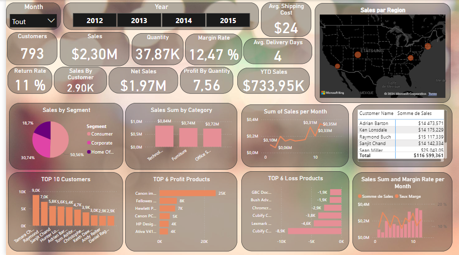

# Projet Business Intelligence (BI)

Ce projet consiste à utiliser **Power BI** pour effectuer un traitement des données via **Power Query** et leur visualisation sous forme de tableaux de bord interactifs. Les données proviennent du dataset **Global Superstore 2016**, disponible sur Kaggle.

---

## Structure de la base de données

Les données utilisées dans ce projet proviennent de Kaggle et sont structurées comme suit :

| Table     | Total Rows | Total Columns |
|-----------|------------|---------------|
| **Orders**   | 51,290      | 24            |
| **People**   | 24          | 2             |
| **Returns**  | 1,079       | 3             |

Ces tables ont été importées dans Power BI, croisées et transformées via Power Query pour permettre une analyse approfondie.

---

## Fonctionnalités

- **Traitement des données dans Power Query** :
  - Nettoyage des données brutes.
  - Création de relations entre les tables.
  - Calculs personnalisés pour enrichir les données.

- **Visualisation des données** :
  - Création de tableaux de bord interactifs.
  - Analyse des performances commerciales via des indicateurs clés.
  - Exploration interactive des tendances et des anomalies.

---

## Captures d'écran

Aperçu du tableau de bord Power BI réalisé :



---

## Étapes pour utiliser ce projet

1. Clonez le dépôt sur votre machine locale :
   ```bash
   git clone https://github.com/rimbergaoui/BI_Project.git
